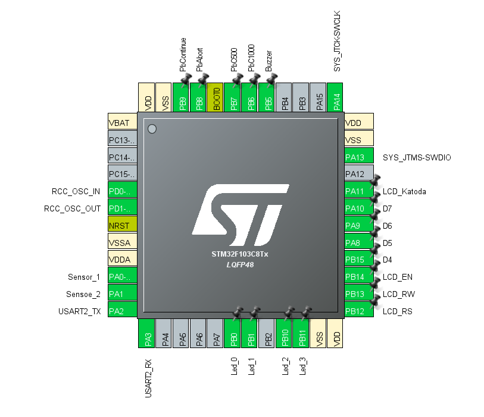

# simple-vending-mechine
merupakan project untuk sistem embeded yaitu bertujuan untuk membuat vending mechine dengan konsep sederhana dengan mengguunakan microkontroller STM32F103C8

SIMPLE VENDING MECHINE
Penerapan algoritma vending mechine secara sederhana dengan mengunakan Algoritma State Mechine dengan mengunakan Schedular(Timer) pada STM32F103C8.
dengan menggunakan Presacaller adalah 0 dan Auto Reload Register adalah 72 diharapkan melakukan task yang ditentukan setiap 1uS

Diatas merupakan pinout konfigurasi yang digunakan pada project kali ini. menggunakan LCD 20x4 dan LED 5mm untuk interface
